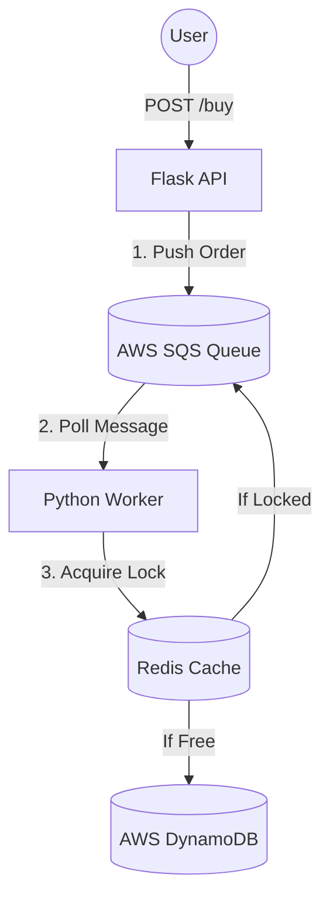

# Flux-Order: High-Concurrency Ticketing System


*A resilient, event-driven microservices architecture designed to handle high-traffic flash sales without race conditions or inventory overselling.*

##  Architecture

- **API (Flask):** Accepts orders and pushes them to an SQS Queue (Asynchronous processing).
- **Worker (Python):** Polls SQS, acquires a Distributed Lock (Redis), and updates DynamoDB.
- **Infrastructure:** Fully managed via Terraform (IaC).
- **Orchestration:** Docker Compose.

##  Tech Stack
- **Language:** Python 3.11
- **Cloud:** AWS (SQS, DynamoDB)
- **Containerization:** Docker & Docker Compose
- **IaC:** Terraform
- **Database:** Redis (Locking), DynamoDB (Storage)

##  Key Features
- **Zero Race Conditions:** Uses Redis `SET NX` (Mutex) to ensure atomic inventory checks.
- **Scalable:** Workers can be scaled horizontally (`docker-compose up --scale worker=3`).
- **Fault Tolerant:** Failed orders are returned to the queue for retry.

##  How to Run
1. **Infrastructure:**
   ```bash
   cd terraform
   terraform init && terraform apply
   ```
2. **Configuration:**
   Create a `.env` file in the root directory with your AWS credentials and Terraform outputs:
   ```ini
   # AWS Credentials
   AWS_ACCESS_KEY_ID=your_access_key
   AWS_SECRET_ACCESS_KEY=your_secret_key
   AWS_REGION=ap-south-1

   # Infrastructure Config (From Terraform Outputs)
   SQS_QUEUE_URL=https://sqs.ap-south-1.amazonaws.com/123456789/flux-queue-iac
   DYNAMODB_TABLE=FluxOrdersIAC

   # Redis Config
   REDIS_HOST=redis
   REDIS_PORT=6379
   ```
3. **Deploy: Run the containers in the background:**

```Bash

docker-compose up --build -d
```
4. **Test: Send a buy request:**

```PowerShell

Invoke-RestMethod -Uri "http://localhost:5000/buy" -Method Post -ContentType "application/json" -Body '{"user_id": "test_user", "item_id": "ticket_1"}'
```
