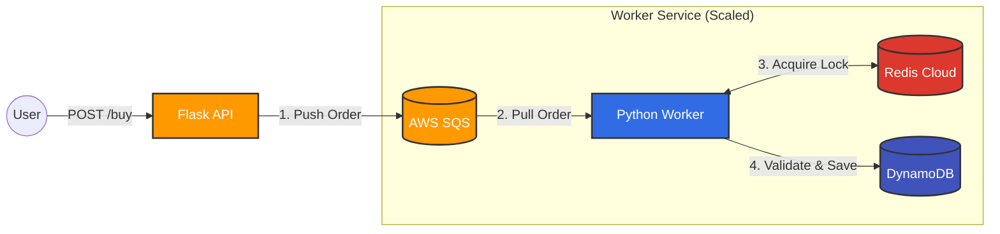

# Flux-Order: High-Concurrency Flash Sale Engine 

Flux-Order is a distributed order processing system designed to handle high-traffic "Flash Sale" events (like ticket sales or product drops) without crashing or overselling inventory. 

It solves the classic **"Double Booking" Race Condition** problem using **Redis Distributed Locks (Mutex)** and decouples traffic using **AWS SQS**.

---

##  Architecture


**The Flow:**
1.  **Ingestion:** User hits the API (`/buy`). The request is instantly acknowledged and pushed to an **AWS SQS** queue (The Waiting Room).
2.  **Processing:** A background **Worker** pulls the order from SQS.
3.  **Locking (Critical):** The worker attempts to acquire a **Redis Mutex Lock** for the specific Item ID.
    * *If Locked:* Wait/Retry.
    * *If Free:* Lock it for processing.
4.  **Validation:** The worker checks **DynamoDB** to see if the item is already `SOLD`.
5.  **Completion:** If unsold, it updates DynamoDB to `SOLD` and deletes the SQS message.

---

## Key Features
* **Zero Overselling:** Uses Redis `SET nx=True` (Atomic Locks) to ensure only *one* worker can process a specific ticket at a time.
* **Asynchronous Processing:** API responds in <100ms by offloading work to SQS, allowing the system to handle burst traffic.
* **Idempotency:** Checks the "Ledger" (DynamoDB) before selling to prevent duplicate processing of the same order.
* **Scalable:** You can run 50+ worker instances in parallel to process the queue faster without breaking data consistency.

---

## Tech Stack
* **Language:** Python 3.9+
* **API:** Flask
* **Queue:** AWS SQS (Simple Queue Service)
* **Locking/Cache:** Redis (Cloud)
* **Database:** AWS DynamoDB
* **Infrastructure:** Boto3 (AWS SDK)

---

## Setup & Installation

### 1. Prerequisites
* Python 3.x installed.
* An AWS Account (with SQS and DynamoDB access).
* A Redis Cloud instance (free tier is fine).

### 2. Clone the Repository
```bash
git clone https://github.com/Tannishaa/Flux-Order.git
```
3. Virtual Environment
```Bash
# Windows
python -m venv venv
.\venv\Scripts\activate

# Mac/Linux
python3 -m venv venv
source venv/bin/activate
```
4. Install Dependencies
```Bash

pip install -r requirements.txt
```
5. Environment Variables (Security)
* Create a .env file in the root directory. Do not hardcode secrets.

```Ini, TOML

AWS_REGION=ap-south-1
SQS_QUEUE_URL=https://sqs.ap-south-1.amazonaws.com/YOUR_ID/flux-order-queue
REDIS_HOST=your-redis-url
REDIS_PORT=14579
REDIS_PASSWORD=REMOVED_PASSWORD
```
## Usage
### Step 1: Start the API
In one terminal, run the producer API. This simulates the website accepting traffic.

```Bash

python api.py
Server running on https://www.google.com/search?q=http://127.0.0.1:5000
```

### Step 2: Start the Worker
In a second terminal, run the consumer worker. This simulates the backend processor.

```Bash

python worker.py
```
*Worker is listening for orders...*

### Step 3: Simulate a Race Condition 
Send two requests for the same ticket (ticket_001) from two different users.

Request 1 (Success):

```Bash

curl -X POST -H "Content-Type: application/json" -d '{"user_id":"Tanisha", "item_id":"ticket_001"}' [http://127.0.0.1:5000/buy]
```
Request 2 (Rejection):

```Bash

curl -X POST -H "Content-Type: application/json" -d '{"user_id":"Tanisha_Real", "item_id":"ticket_001"}' [http://127.0.0.1:5000/buy]
```
Expected Output in Worker Terminal:
```
 SELLING: Item ticket_001 to Tanisha... 
 SUCCESS: Saved to Database. ... 
 LOCK ACQUIRED: Checking inventory for ticket_001... 
 REJECTED: Tanisha_Real wants ticket_001, but it is ALREADY SOLD!
```
## Future Improvements
* Implement Dead Letter Queues (DLQ) for failed orders.

* Add a Streamlit Dashboard to visualize queue depth in real-time.

* Containerize the worker using Docker.

###### Made by: Tanisha
