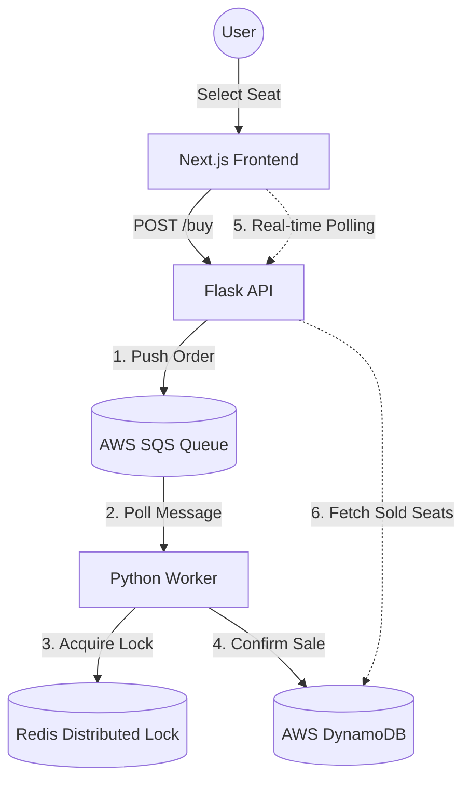

# Flux-Order: High-Concurrency Ticketing System

*A resilient, event-driven microservices architecture designed to handle high-traffic flash sales without race conditions or inventory overselling.*

* **Frontend Repository:** This project works in tandem with the [Flux Cinema Frontend](https://github.com/Tannishaa/flux-cinema-frontend)

## Architecture

```mermaid
graph TD
    User((User)) -->|Select Seat| FE[Next.js Frontend]
    FE -->|POST /buy| API[Flask API]
    API -->|1. Push Order| SQS[(AWS SQS Queue)]
    SQS -->|2. Poll Message| Worker[Python Worker]
    Worker -->|3. Acquire Lock| Redis[(Redis Distributed Lock)]
    Worker -->|4. Confirm Sale| DB[(AWS DynamoDB)]
    FE -.->|5. Real-time Polling| API
    API -.->|6. Fetch Sold Seats| DB
```
- **API (Flask)**: Hosted on Render, accepts orders and pushes them to an SQS Queue to prevent server saturation.
- **Worker (Python)**: Polls SQS, acquires a Distributed Lock (Upstash Redis), and updates DynamoDB.
- **Infrastructure**: AWS resources fully managed via Terraform (IaC).
- **Deployment Strategy**: Hybrid-Cloud (Cloud-hosted API/DBs with decoupled background workers), with full local Docker Compose support

##  Tech Stack
- **Language**: Python 3.11
- **Cloud Infrastructure**: AWS (SQS, DynamoDB), Render (API Hosting), Upstash (Serverless Redis)
- **Containerization**: Docker & Docker Compose (Local Dev)
- **IaC**: Terraform
- **Testing**: Locust (Load Testing), Pytest (Unit Testing)
##  Key Features
- **Zero Race Conditions:** Uses Redis `SET NX` (Mutex) to ensure atomic inventory checks before database writes.
- **Live Inventory Sync:** Frontend utilizes a 2-second polling mechanism against the database to visually lock seats globally the moment a transaction is verified.
- **Fault Tolerant:** Asynchronous message queueing ensures failed orders are safely returned to SQS for retry without data loss.
- **High Concurrency:** Sustainably load-tested to handle 21,000+ concurrent requests with 0% error rate via Locust.

##  System Performance & Observability
- **Monitoring:** Implemented a custom TUI (Terminal User Interface) dashboard using the Rich library to monitor real-time queue depth, system vitals, revenue, and worker health.
- **Race Condition Testing:** Verified using two simultaneous frontend sessions; Redis Distributed Locking successfully rejected overlapping requests for the same `item_id`.
- **Latency:** Sub-second processing time from SQS message pickup to DynamoDB confirmation.

##  Logic & Architecture
This project is an exploration of high-concurrency distributed systems.

* **Message Broker:** Utilizes AWS SQS for decoupling ingestion layer from the processing layer.
* **Concurrency Control:** Implements a Redis-based Distributed Lock (Mutex) to prevent race conditions during simultaneous seat selection.
* **Database:** DynamoDB for persistent, low-latency storage of confirmed orders.
 **Note:** `To protect the integrity of the project and prevent unauthorized duplication, setup and deployment instructions are not provided publicly. If you are a recruiter or an engineer interested in the infrastructure setup, please reach out to me directly!`

## Security & Resilience
**Secret Management:** Utilizes environment variables via `.env` files (excluded from version control) and Docker `env_file` injection.

**Infrastructure Security:** Uses IAM roles with least-privilege access for AWS SQS and DynamoDB interactions.

**History Hygiene:** Repository history is periodically audited and scrubbed of any legacy configuration strings using `git-filter-repo`.